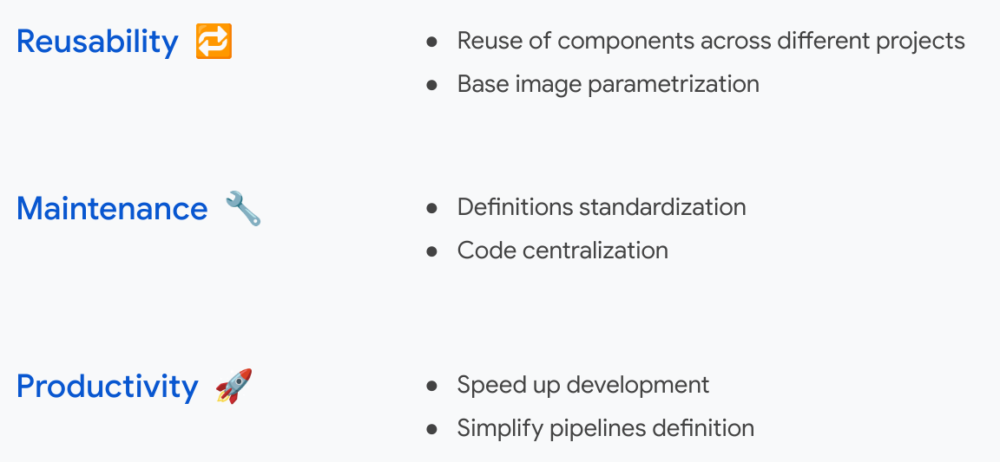
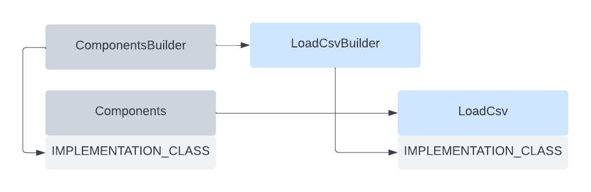

# Custom KFP Components
Custom KFP Components is a python package intended to ease and improve developers experience when 
developing Kubeflow pipelines.
It consists of a set of modules that contain some pre-build components which are parametrized, 
so that they can easily be imported and most importantly re-used amongst different projects.

## Goals


## Architecture
Base classes [custom_kfp_components/components.py]: 
* **CoeComponentsBuilder:** Parent class containing the required methods to decorate a function as a Python Component
* **CoeComponents:** Wrapper class that returns a Python Component

Custom components classes:  
* *****Builder** (e.g. LoadCsvBuilder or LabelEncofingBuilder): Child class defining component’s code and requirements
* *** (e.g. LoadCsv or LabelEncoding): Wrapper class that returns a Python Component with the logic defined in the ***Builder class



## Components available
Here's a list of supported components:
* LoadCsv (`from custom_kfp_components.data_ingestion.load_csv import LoadCsv`)
* LabelEncoding (`from custom_kfp_components.data_preparation.label_encoding import LabelEncoding`)

## Usage
Below you can find a brief snippet showing the package's usage.
```
from kfp import dsl

from custom_kfp_components.data_ingestion.load_csv import LoadCsv
from custom_kfp_components.data_preparation.label_encoding import LabelEncoding 


@dsl.pipeline
def pipeline():
    file = 'sample.csv'
    label = 'label_to_encode'
    
    data_load = LoadCsv(
        base_image='python:3.7',
        file_path=file)
    
    label_encoding = LabelEncoding(
        label_name=label,
        input_dataset=data_load.outputs['dataset'])
```
